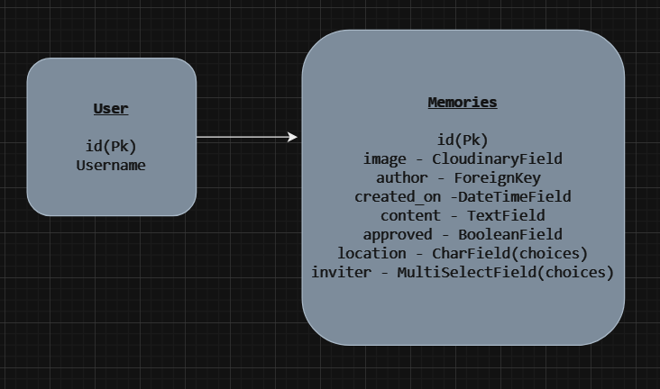
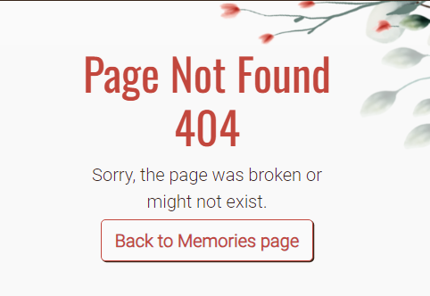
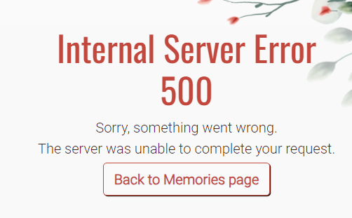

# THE W INVITATION

The W Invitation is a wedding website. The website is for a Groom and a Bride to share with the guests of the event.
This way, all register users will be able to get more information about the wedding on the home page so they can  participate but also share teir memories on a specific page.
The goal is to replace paper wedding invitation and share event's memories with the couple and other guests on the same media. This is similar to a guestbook but online.

Project url :[The W Invitation](https://the-w-invitation-104939a4f065.herokuapp.com/)

## Table of Content

* [User Experience](#user-experience)
* [Design](#design)
* [Security Features](#security-features)
* [Features](#features)
* [Technologies Used](#technologies-used)
* [Deployments](#deployments)
* [Testing](#testing)
* [References](#references)

## User Experience

The website has been design for a seamless, smooth and cute design to respect its goal. It is intuitive and invite the user to participate fully at the wedding. The website is responsive so the user is able to easily access on any device plus it is accessible for blind users.

### Project Goals

The goal of [The W Invitation](https://the-w-invitation-104939a4f065.herokuapp.com/) is to replace paper invitation and for guests to share their event's memories with the bride, the groom and all participants.
It invites all participants to come to the event and take pictures from their view, share stories and congratulation messages. As a wedding event can get busy, it can be interesting to share those memories with people who might have missed the moment.

### Agile MethodologyProject Board

Agile Methodology was used to help prioritize and organize tasks, writing the user stories first on Excel then using the Project Boards on Github. They were as precise as possible to have a good organization and not forget a step.
A **template** was created to help write User Stories and define Epics.

- Epics were written containing possible user stories and based on that the website was made.
- User stories were created by looking at epics and through iterations the project was advancing.
- Labels were added to sort the issues based on the importance which resulted to have unclosed issues as labelled as "won't have":
  - [Closed issues](https://github.com/Shiimymy/the-W-invitation/issues?q=is%3Aissue+is%3Aclosed).
  - [Opened issues](https://github.com/Shiimymy/the-W-invitation/issues?q=is%3Aopen+is%3Aissue).
- The [Project Board](https://github.com/users/Shiimymy/projects/9) is set to public.
- The [Project Board](https://github.com/users/Shiimymy/projects/9) was used to track progression of the task through the Todo, In progress and Done columns:

#### User Stories

1. EPICS

- Home page access
- Responsiveness
- Accessibility
- Admin Sign in
- Guest List management
- Guest Sign In
- Guest Home page
- Memories Page Views
- Memories Page Participation
- Memories filter
- Alert Messages
- Home Page Management
- Guest Notification
- Guest Page

1. User Stories

- [As an user I can access the home page event **so that** I can see general information about the wedding.](https://github.com/users/Shiimymy/projects/9?pane=issue&itemId=44649250)
- [As an user, I can use different device so I can access the event website](https://github.com/users/Shiimymy/projects/9/views/1?pane=issue&itemId=44650183)
- [As a blind user, I can access website information so that I can prepare for the weeding.](https://github.com/users/Shiimymy/projects/9/views/1?pane=issue&itemId=44653680)
- [As an admin, I can sign in so that I can access my admin page](https://github.com/users/Shiimymy/projects/9?pane=issue&itemId=44650185)
- [As an admin, I can manage the guest list so that I can add edit or delete a guest.](https://github.com/users/Shiimymy/projects/9/views/1?pane=issue&itemId=44653667)
- [As a guest, I can sign in so that I can access more detailed information about the wedding](https://github.com/users/Shiimymy/projects/9?pane=issue&itemId=44653669)
- [As a guest and admin, I can access the home page event so that I can see details information about the wedding to prepare myself.](https://github.com/users/Shiimymy/projects/9/views/1?pane=issue&itemId=44653671)
- [As an admin or guest, I can access the Memories page so that I can view the Memories with pictures taken during the event or comments guest or admin would have add.](https://github.com/users/Shiimymy/projects/9?pane=issue&itemId=44653675)
- [As a guest or admin, I can send memories from the Memories page so that I can share comments or pictures I took during the weeding.](https://github.com/users/Shiimymy/projects/9/views/1?pane=issue&itemId=44653676)
- [As an guest or admin I can select categories in the Memory Page so that I can filter the memory's posts.](https://github.com/users/Shiimymy/projects/9?pane=issue&itemId=48681868)
- [As an guest or admin I can see alert messages so that it confirms the action I took.](https://github.com/users/Shiimymy/projects/9/views/1?pane=issue&itemId=48682140)
- [As an admin, I can edit the wedding information so that I can update the home page if there is any plan change.](https://github.com/users/Shiimymy/projects/9/views/1?pane=issue&itemId=44653673)
- [As an admin, I can add an email address in the guest details so that the guest receive a guest confirmation by email.](https://github.com/users/Shiimymy/projects/9/views/1?pane=issue&itemId=44653674)
- [As a guest, I can edit or delete my details so that I can manage my details from my guest page](https://github.com/users/Shiimymy/projects/9/views/1?pane=issue&itemId=44653670)

### Target Audience

- Bridals who wish to have a digital invitation.
- Bridals who wish to have an easy and centralized access to the pictures and stories of their wedding.
- Guests who would like to share their pictures and stories with the bridals and other guests.

### First time user

- Simple and intuitive website navigation with little information for non-register user.
- Welcoming, soft and floral visual that respect the website theme.
- Easy Login and Registration.

### Registered user

- Seamless login process with a secure and personalized user account.
- Access to more information on the home page with more details about the schedule of the event.
- Access to the Memories page to view memories posts.
- Ability to participate in adding, editing or deleting your own memories via the Memories page.

### Admin user

- Access to an admin dashboard for managing memories posts and guest(users).
- Ability to add, edit, or delete guest.
- Ability to add, edit, or delete memory posts.
- Ability to approve a post which has been add or edit via the Memories page.

## Design

To be coherent, the website colours were chosen depending on the flower frame we can see on all pages. Flowers were indeed integrated to respect the theme of the website. As such, a white background was choosen which remind the white wedding dresses.

### Colour Scheme

### Images

- Home page header image and placeholder memory image were found on [Pexels](https://www.pexels.com/)
- The Frame image was found on [Vecteezy](https://www.vecteezy.com/)

### Typography

The 'Roboto' font is specified as the primary font, and the 'Oswald' font is is used for the main tittles.

### Wireframes

**Global view of the website dynamic:**

**View of the first user pages wireframes:**

We can see below the wireframes of the first user home page and sign in (register page has the same logic).

**View of the logged in user pages wireframes:**

### Data Model

1. **AllAuth User Model.**

- Django Allauth, the User model is the default user model provided by the Django authentication system
- The User entity has a one-to-many relationship with the Memories entity. This means that an User can have multiple Memories, but each Memories is associated with only one User.
- The Users can register themselves or the admin can add a new user through djangos admin panel.

2. **Memories Model.**

- Model created for admin and logged in users (guests) for them to be able to add a new memory on the Memories page.
- An user can have multiples memories but would be deleted if the admin decides to delete the user.
- Admin can add/edit/delete memories through djangos admin panel.
* Users are able to add and edit memories via a form. Adding a picture (CloudinaryField) is not a requirement in the form if user wants only to leave a message but have to complete the other fields : location (CharField), inviter and content (TextField). The two first have predefined selectable information. Only one location can be selected but 2 inviters can be selected as a [MultiSelectField](https://pypi.org/project/django-multiselectfield/) was used.
- The users **can't** add/edit the following information : author (ForeignKey linked to AllAuth User Model) and post creating date (DateTimeField).
- Full CRUD functionality is available for the users but each memory have to be **approuved** via the admin page to avoid messages or pictures the bridals wouldn't like to see on their website.

### Database Scheme

The Memories represent the posts that the admin and user can view in the Memories page. It is also used for them to be able to add/edit/delete their Memories. They are auto complete fields : author, created_on and approved set to False to prevent unwanted pictures/messages.
The image field is not required to allow users to leave only a message if they wish. However, all other fields are required from the person creating the Memory : content, location and inviter. The last two have choices/options that are directly included in the Database:  
* For the location, the author will be able to select one of those choices : Church, Town Hall, Venue and Other.
* For the inviter, the author will be able to select the two choices if he wants : Groom and/or Bride.

## Security Features

1. User Authentication
   [Django Allauth](https://docs.allauth.org/en/latest/) is a package that provides user authentication for Django applications. It is an easy-to-use solution that supports many authentication methods, including email and password authentication, and more. Django AllAuth is an excellent choice for developers who want to implement user authentication quickly and securely.

2. Login Decorator
   The [@login_required decorator](https://docs.djangoproject.com/en/5.0/topics/auth/default/#the-login-required-decorator) in Django is a way to restrict access to views based on the authentication status of a user. If a user is not authenticated, they are redirected to the login page. This decorator adds an extra layer of security by ensuring that only authenticated users can access certain views.
   In the project, it is used for the edit_memory and delete_memory views.

3. LoginRequiredMixin
   The [LoginRequiredMixin](https://docs.djangoproject.com/en/2.1/topics/auth/default/#the-loginrequired-mixin) is used with class based views nd is generally the first inherited class in any of our views. It is similar to the login decorator at it prevent also not authenticate user to have access to views.
   In the project, it was used for Memorieslist and MemoryPost class views.

4. CSRF Protection
   A [CSRF token](https://docs.djangoproject.com/en/5.0/ref/csrf/) is a secure random token (e.g., synchronizer token or challenge token) that is used to prevent CSRF (Cross-Site Request Forgery) attacks. It is used in Django as a feature to get away from attacks. When the session of the user starts on a website, a token is generated which is then cross-verified with the token present with the request whenever a request is being processed.

5. Form Validation
   The forms to add or edit memories use built in "required" feature from Django forms. The only field that is not required is the image field as users don't have to select an image to create a memory. This was done using blank=True in the Memories models.

6. Edit/Delete protection
   A security in the backend has been place to allow only the author of a specific memory to access the edit and delete functionality and will throw a 404 if someone else try to access it.

## Features

### Existing Features

### Base Page

1. **Navigation**

The navigation bar has different options depending on if a user is authenticated or not. However, the website name on the left and the "Home" link remains the same.

- User in not authenticated.

The navigation option only show two more options "Register" and "Login" which would invite the user to do so.

- User is authenticated.

The user has access to the Memories page via a new link which appeared and to Logout.

1. **Footer**

The footer has different elements such as

- an email which open the email app of the device once clicked on it,
- two links to the bridals wedding social media pages.

### Authentication pages

1. **Login page**

Django sign in page was used to create this page and then customized with CSS.

A message will confirm the action once the button sign in clicked :

2. **Register page**

Django register page was used to create this page and then customized with CSS.

The same message as sign in will confirm the action once the button sign up clicked.

3. **Logout page**

Django logout page was used to create this page and then customized with CSS.

A message will confirm the action once the button sign out clicked :

### Home page

The home page presentation has to be differentiated depending on either a user has been authenticated or not as different information will be accessible.

1. **User not authenticated**

The invitation has restricted and general information:

Then the next section is inviting the reader to either login or register to know more about the event:

2. **User authenticated**

Once the guest/user authenticated, the invitation has more detailed information of when and where the wedding is taken place:

Then the next section content is replaced with detailed information about a lunch following the wedding ceremony:

### Memories Page

The Memories page is where the user is able to view Memories posts and participate fully to the website by adding and editing his memories. It is similar to guestbook but user can add as much memories as thay want and add pictures.

1. **Add memory button**

A clear button which invite the user to participate to the Memories page. This button redirect to another page called the Add Memory page.

2. **Filters**

The users can use 2 filters simultaneously as a lot of memories can be share. It is granting a better access to what an user could be looking for.
The location filter can have only one option selected at the same time whereas the bridals guest filter can have two options selected at the same time. A "Clear" button is also available for a smooth experience.

3. **Memory posts**

A post has different features depending if the authenticated user is the author of a post or not.
If the user is not the author of a post, not functionality will be available for him.

However, if the user is the author, he will access to two different buttons which will allow him to Edit or Delete his memory. They both redirect to their own page.

### Add Memory page

This page is the page where an user land after clicking the "Add Memory" button in the Memories Page. It is a form in which all fiedls are required to add a Memory expect the image field. This field will have a placeholder image if the user doesn't want to share a picture.
If the user change his mind, a cancel button is available for a smooth experience.

A message will confirm the action once the button add clicked : 

### Edit Memory page

This page is the page where an user land after clicking an Edit button in the Memories Page. It has the same requirements as the Add Memory page.
If the user change his mind, a cancel button is also available for a smooth experience.

A message will confirm the action once the button edit clicked :

### Delete Memory page

This page is the page where an user land after clicking the "Delete" button in the Memories Page. It has been created to safely confirm the deletion as per safe programming principle.

A message will confirm the delete action once the button delete clicked :

### Error pages

- Error 404 page

If the user try to access a page not available on the website, this page will show with a button to redirect to the Memories page.

- If the user try to add a wrong format to one of the forms, this page will show with a button to redirect to the Memories page.

### Features Left to Implement

- Guest page: The guests will have the possibility to edit their personal information and view only their own memories for a better management.
- Likes: Like will be implement to increase the participation of all users.
- Contact Page: A contact page will be created for the user to send messages to the admin if they ahve any requests.
- Home page management: the admin will be able to edit information on the home page in case there is any update.
- Adding the Social links in the footer to the logos once the pages will be created.

## Technologies Used

### Languages Used

- [HTML5](https://developer.mozilla.org/en-US/docs/Glossary/HTML5)
- [CSS](https://developer.mozilla.org/en-US/docs/Web/CSS)
- [JavaScript](https://developer.mozilla.org/en-US/docs/Web/JavaScript)
- [Python](https://developer.mozilla.org/en-US/docs/Glossary/Python)

### Databases Used

- [ElephantSQL](https://www.elephantsql.com/) - Postgres database
- [Cloudinary](https://cloudinary.com/) - Online static file storage

### Frameworks Used

- [Django](https://docs.djangoproject.com/en/5.0/) - Python framework
- [Bootstrap v5](https://getbootstrap.com/docs/5.2/getting-started/introduction/) - CSS framework
- [Djanfo crispy Form App](https://django-crispy-forms.readthedocs.io/en/latest/install.html) - Django app

### Programs Used

- [Github](https://github.com/) - Storing the code online
- [Heroku](https://www.heroku.com/home) - Used as the cloud-based platform to deploy the site.
- [Google Fonts](https://fonts.google.com/) - Import the website's fonts.
- [Animate.css](https://animate.style/) - used for the the home page header.
- [Am I Responsive](https://ui.dev/amiresponsive) - To show the website image on a range of devices.
- [Font Awesome](https://fontawesome.com/) - Used to have icons.
- [W3C Markup Validation Service](https://validator.w3.org/) - Used to validate HTML
- [CSS Validation Service](https://jigsaw.w3.org/css-validator/) - Used to validate CSS
- [Jshint](https://jshint.com/) - Used to validate JavaScript
- [Pep8ci](https://pep8ci.herokuapp.com/#) - Used to validate Python
- [InVision](https://www.invisionapp.com/) - used for the wireframe

## Deployments

### Local Development

- **Fork template**: The first step before coding was to fork the [ci-full-template](https://github.com/Code-Institute-Org/ci-full-template) from [Code Institute](https://codeinstitute.net/ie/) as asked. To do so, once on the ci-full-template in Github (as per the first link), I clicked on Fork on the top-right of the page. Then I renamed the repository with the name of my project under Repository name and clicked to Create Fork. This allowed me to update the template.

- **Clone project**:

This project will be also cloned to work locally on future released by following these steps:

1. Go in [The W Invitation](https://github.com/Shiimymy/the-W-invitation) repository,
2. Click on Code to find the URL and copy it.
3. In the Terminal write git clone and paste the url.
4. Press Enter to create the clone

### ElephantSQL Database

### Cloudinary

[The W Invitation](https://the-w-invitation-104939a4f065.herokuapp.com/) is using [Cloudinary](https://cloudinary.com/).

1. For Primary interest, you can choose Programmable Media for image and video API.
2. Optional: edit your assigned cloud name to something more memorable.
3. On your Cloudinary Dashboard, you can copy your API Environment Variable.
4. Be sure to remove the CLOUDINARY_URL= as part of the API value; this is the key.

### Heroku Deployment

[The W Invitation](https://the-w-invitation-104939a4f065.herokuapp.com/) is deployed on [Heroku](https://www.heroku.com/home) and the following steps have been followed:

1. Added dependencies in the requirement.txt file.
2. Once log in to the [Heroku Dashboard](https://dashboard.heroku.com/apps), click on the button Create New App
3. File the form by choosing a name for the App, the region and click on the button Create app.
4. Click on the Settings tab.
5. In Config Var section, click on Reveal Config Var.
6. Add a first key called CLOUDINARY_URL and the value should be yur own Cloudinary API key, then click Add.
7. Add a second key called DATABASE_URL and the value should be your own ElephantSQL database URL, then click Add.
8. Add a thrid key called PORT and the value should be 8000 for the p3-template being compatible with Heroku, then click Add.
9. Add a fourth and last key called SECRET_KEY and the value should be the same as the one in your project env.py, then click Add.
10. In the Buildpacks section, click on the button Add buildpacks.
11. Click on the button Python and then click Save changes.
12. In the Buildpacks section again, click on the button Add buildpacks another time.
13. Click on the button nodejs and then click Save changes.
14. At the top of the page, click on the Deploy tab.
15. In the Connect to Github section, click on Connect to Github.
16. In the Connect to Github section, search for the repository name, click Search and the Connect once found.
17. Choose between Automatic deploys or Manual deploys :
- For Heroku to rebuild the app every time a new change is pushed, click on Enable Automatic Deploys.
- To manually deploy , click on Deploy Branch.
18. Once the App deployed, click on View to access deployed link.

## Testing

Please see [TESTING.md](TESTING.md) for all the detailed testing performed.

## References

### Documentation

- [Stack Overflow](https://stackoverflow.com/)
- [MDN](https://developer.mozilla.org/fr/)
- [Code Institute](https://codeinstitute.net/)
- [Bootstrap v5.2](https://getbootstrap.com/docs/5.2/getting-started/introduction/)
- [Django docs](https://www.djangoproject.com/)
- [Django Allauth](https://docs.allauth.org/en/latest/)
- [Cloudinary](https://cloudinary.com/documentation)
- [Google](https://www.google.com/)
- [PyPI](https://pypi.org/)

### Content

1. Images
 - Home page header image and placeholder memory image were found on [Pexels](https://www.pexels.com/)
 - The Frame image was found on [Vecteezy](https://www.vecteezy.com/)

2. Content
The content was created by using actual Dundalk, co.louth locations. Everything else is a fiction and written by the [developer](https://github.com/Shiimymy).

### Acknowledgments

I would like to thank my mentor for support and feedback throughout this project, **Mitko Bachvarov**.

I would also like to extend my appreciation to the tutors of [Code Institute](https://codeinstitute.net/) who helped me with troubleshooting.
